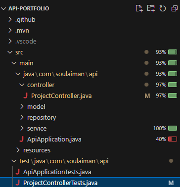
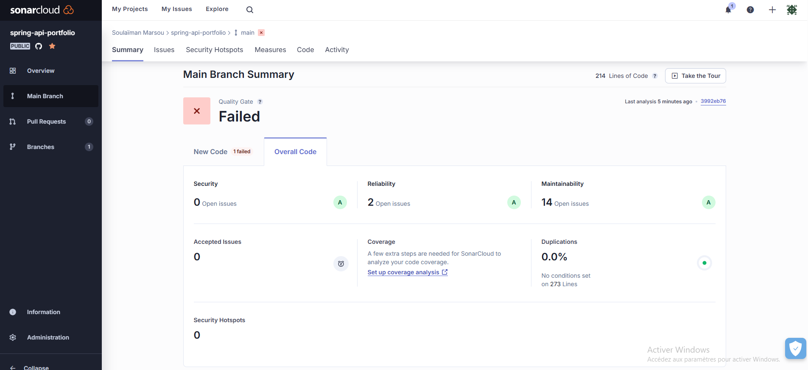

# Spring Api Portfolio

This microservice API supports my portfolio web application (see the corresponding repository for more details). It handles CRUD operations for the database, managing the projects displayed in my portfolio.

The data managed includes each project's HTML content and related topic titles. Topics allow users to view projects grouped by specific themes.

The REST API communicate for now with an H2 in memory database. 

## Roadmap

- Connect a PostgreSQL database instead of an H2

## API Documentation

I'm using Apiary for the online documentation.

You can find it there : https://smarsousportfolioapi.docs.apiary.io/.

To resume, the endpoints of the API are :
- **List all projects :** GET /project 
- **Get a project :** GET /project/{id}
- **Create a project :** POST /project
- **Modify a project :** PUT /project/{id}
- **Delete a project :** DELETE /project/{id}

## Tests

### Unit tests

Unit tests are implemented through the class ProjectControllerTests.
The coverage is 93%.

### SonarCloud

I use SonarCloud to follow the quality of my code. It teaches me a lot of best practices in web development.

You can have a quick view of the current analysis of the repository below.

